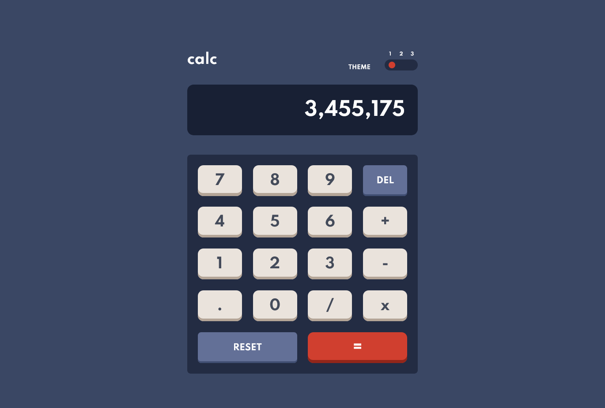
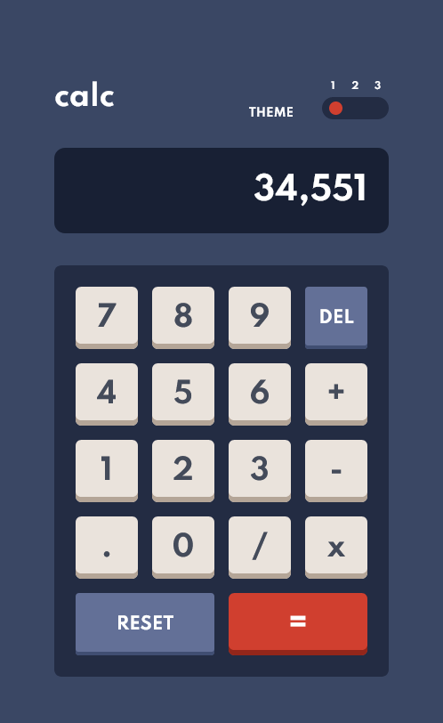
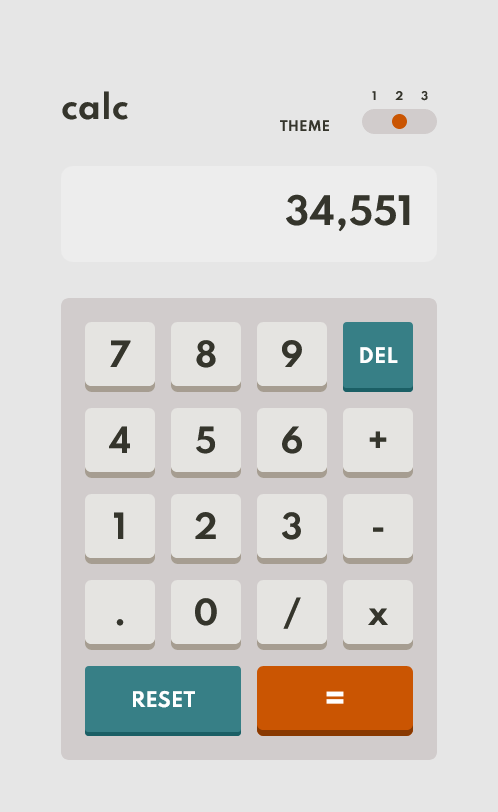
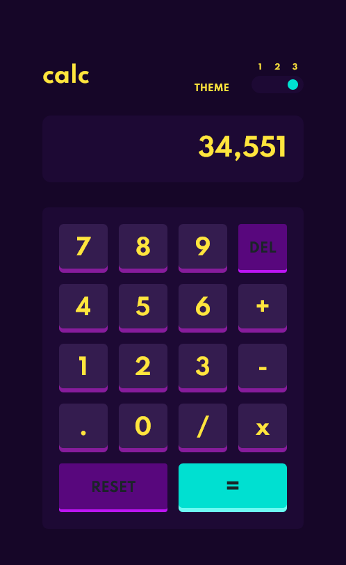

# Frontend Mentor - Calculator app solution

This is a solution to the [Calculator app challenge on Frontend Mentor](https://www.frontendmentor.io/challenges/calculator-app-9lteq5N29). Frontend Mentor challenges help you improve your coding skills by building realistic projects. 

## Table of contents

- [Overview](#overview)
  - [The challenge](#the-challenge)
  - [Screenshot](#screenshot)
  - [Links](#links)
- [My process](#my-process)
  - [Built with](#built-with)
  - [What I learned](#what-i-learned)
  - [Continued development](#continued-development)
- [Author](#author)

## Overview

### The challenge

Users should be able to:

- See the size of the elements adjust based on their device's screen size
- Perform mathmatical operations like addition, subtraction, multiplication, and division
- Adjust the color theme based on their preference

### Screenshot







### Links

- Solution URL: [FrontendMentors Calculator App](https://www.frontendmentor.io/solutions/calculator-app-react-7KNg6o_zc)
- Live Site URL: [https://steppan26.github.io/Challenge-05--Calculator-App/](https://steppan26.github.io/Challenge-05--Calculator-App/)

## My process

### Built with

- Semantic HTML5 markup
- CSS custom properties
- Flexbox
- CSS Grid
- Mobile-first workflow
- React - JS library


### What I learned

This was a really fun challenge which really pushed me to try and find creative solutions to some seemingly complex problems. My code evolved a lot throughout the development stage, even completely rewriting large parts of it at times, but I feel that I have come to a solution I am happy with.
It was particularly interesting to see my methods and decisions change throughout the creation of this app as I encountered new problems and learnt new skills.
I knew from the get-go exactly how I was going to make the theme switcher work, and it is very pleasing that I was able to implement this method and have it work.

I am particularly happy with the 'getKey' function present in App.js which takes in an input and uses a long switch/case statement to generate the desired outcome. I feel that there may be cleaner or more efficient solutions to the same problem, but I also feel this is quite elegant as it is easy to read and determine the outcome (it would also be very easy to modify the code to get a different outcome):

```js
getKeyCode = (key, buttonsArray) =>{
    switch(key){
      default:
        break
      case "0":
        //fallsthrough
      case 48:
        //fallsthrough
      case 96:
        buttonsArray.forEach((button) =>{
          if(button.textContent === "0"){
            this.numberButtonInput(button)
          }
        })
        break
      case "1":
        //fallsthrough
      case 49:
        //fallsthrough
      case 97:
        buttonsArray.forEach((button) =>{
          if(button.textContent === "1"){
            this.numberButtonInput(button)
          }
        })
        break
      case "2":
        //fallsthrough
      case 50:
        //fallsthrough
      case 98:
        buttonsArray.forEach((button) =>{
          if(button.textContent === "2"){
            this.numberButtonInput(button)
          }
        })
        break
      case "3":
        //fallsthrough
      case 51:
        //fallsthrough
      case 99:
        buttonsArray.forEach((button) =>{
          if(button.textContent === "3"){
            this.numberButtonInput(button)
          }
        })
        break
      case "4":
        //fallsthrough
      case 52:
        //fallsthrough
      case 100:
        buttonsArray.forEach((button) =>{
          if(button.textContent === "4"){
            this.numberButtonInput(button)
          }
        })
        break
      case "5":
        //fallsthrough
      case 53:
        //fallsthrough
      case 101:
        buttonsArray.forEach((button) =>{
          if(button.textContent === "5"){
            this.numberButtonInput(button)
          }
        })
      break
      case "6":
        //fallsthrough
      case 54:
        //fallsthrough
      case 102:
        buttonsArray.forEach((button) =>{
          if(button.textContent === "6"){
            this.numberButtonInput(button)
          }
        })
      break
      case "7":
        //fallsthrough
      case 55:
        //fallsthrough
      case 103:
        buttonsArray.forEach((button) =>{
          if(button.textContent === "7"){
            this.numberButtonInput(button)
          }
        })
      break
      case "8":
        //fallsthrough
      case 56:
        //fallsthrough
      case 104:
        buttonsArray.forEach((button) =>{
          if(button.textContent === "8"){
            this.numberButtonInput(button)
          }
        })
      break
      case "9":
        //fallsthrough
      case 57:
        //fallsthrough
      case 105:
        buttonsArray.forEach((button) =>{
          if(button.textContent === "9"){
            this.numberButtonInput(button)
          }
        })
      break
      case "x":
        //fallsthrough
      case 106:
        buttonsArray.forEach((button) =>{
          if(button.textContent === "x"){
            this.applyModifier(button.textContent)
            this.setState({screenText: 0})
          }
        })
      break
      case "+":
        //fallsthrough
      case 107:
        buttonsArray.forEach((button) =>{
          if(button.textContent === "+"){
            this.applyModifier(button.textContent)
            this.setState({screenText: 0})
          }
        })
      break
      case "-":
        //fallsthrough
      case 109:
        buttonsArray.forEach((button) =>{
          if(button.textContent === "-"){
            this.applyModifier(button.textContent)
            this.setState({screenText: 0})
          }
        })
      break
      case ".":
        //fallsthrough
      case 110:
        buttonsArray.forEach((button) =>{
          if(button.textContent === "."){
            this.applyModifier(button.textContent)
            this.setState({screenText: 0})
          }
        })
      break
      case "/":
        //fallsthrough
      case 111:
        buttonsArray.forEach((button) =>{
          if(button.textContent === "/"){
            this.applyModifier(button.textContent)
            this.setState({screenText: 0})
          }
        })
      break
      case "DEL":
        //fallsthrough
      case 8:
        buttonsArray.forEach((button) =>{
          if(button.textContent === "DEL"){
            let screenText = String(this.state.screenText) // convert screenText to a string for easy manipulation
            screenText = screenText.slice(0,-1) // remove last character then convert back to string before assigning to screenText
            if(screenText.length <= 0){
              this.setState({screenText:0})
            } else {
              this.setState({screenText:parseFloat(screenText)})
            }
          }})
      break
      case "RESET":
        //fallsthrough
      case 27:
        buttonsArray.forEach((button) =>{
          if(button.textContent === "RESET"){
            this.setState({ screenText: 0, storedValue: 0, activeModifier:"+" })
          }
        })
      break
      case "=":
        //fallsthrough
      case 13:
        buttonsArray.forEach((button) =>{
          if(button.textContent === "="){
            let newValue = this.state.screenText
            const total = this.applyModifier(this.state.activeModifier)
            this.setState({activeModifier:"=", storedValue:newValue})
            this.setState({
              screenText:total,
            })
          }
        })
      break
    }
    return key
  }
```

I am also especially happy with the way I handle the theme switching. As I knew instinctively from the begining how I was going to approach this, I was able to design my CSS using CSS custom variables which would then different depending on which 'Theme' class is active on the App class. This allows a simple change of classname between 'Theme1', 'Theme2' or 'Theme3' which provides different colours for each variable.

An example of the CSS code for 'Theme1' (Theme2 and Theme3 are virtually identical with only the hsl values changing)

```css
.Theme1{
/*#### Backgrounds #### */
--clr-bg-main : hsl(222, 26%, 31%);
--clr-bg-toggle-keypad : hsl(223, 31%, 20%);
--clr-bg-screen : hsl(224, 36%, 15%);

/* #### Keys #### */
--clr-keys-reset-bg : hsl(225, 21%, 49%);
--clr-keys-reset-shadow : hsl(224, 28%, 35%);

--clr-keys-equals-bg : hsl(6, 63%, 50%);
--clr-keys-equals-shadow : hsl(6, 70%, 34%);

--clr-keys-primary-bg : hsl(30, 25%, 89%);
--clr-keys-primary-shadow : hsl(28, 16%, 65%);


/* #### Text #### */
--clr-text-primary : hsl(221, 14%, 31%);
--clr-text-secondary : white;
--clr-text-white : white;
}
```

The theme is determined by using state to loop through an array of 'Theme1', 'Theme2' and 'Theme3' which then gets passed down to the theme switcher as props and also fed into the 'style' attribute for the theme which uses CSS:Grid area names to determine the position of the little toggler. The toggler has an eventlistener which runs a function to iterate through the theme state and update the rest of the app:

```js
createThemeToggler = () =>{
    const themeToggle = document.getElementById("themeSelector")
    themeToggle.addEventListener("click", () => {
      let activeTheme = this.state.activeTheme;
      if (activeTheme >= 2){
        activeTheme = 0
      } else {
        activeTheme = activeTheme + 1
      }
      this.setState({activeTheme: activeTheme})
      this.setHeadingFontColor();
    })
  }
```

I am also happy with how I managed to keep the HTML for App.js small and simple.
```HTML
render(){
    let themeClassName = "AppContainer " + this.state.theme[this.state.activeTheme];
    return (
      <div className={themeClassName}>
        <div className="App">
          <Header activeTheme={this.state.theme[this.state.activeTheme]} screenText={this.state.screenText}/>
          <Calculator />
        </div>
      </div>
    );
  }
```


### Continued development

This was a really nice challenge as it focused a lot on logic and attempting to think of how a user could break the app. Mathematics is not especially flexible so every input has to have a pre-determined outcome, this was particularly challenging and I believe that there are surely some weaknesses in the code and way it is structure. I would like to come back to this someday and re-evaluate the code to see if I could do it better with further knowledge. My next challenge is to work with APIs

## Author

- Website - [GitHub](https://www.your-site.com)
- Frontend Mentor - [@steppan26](https://www.frontendmentor.io/profile/steppan26)
